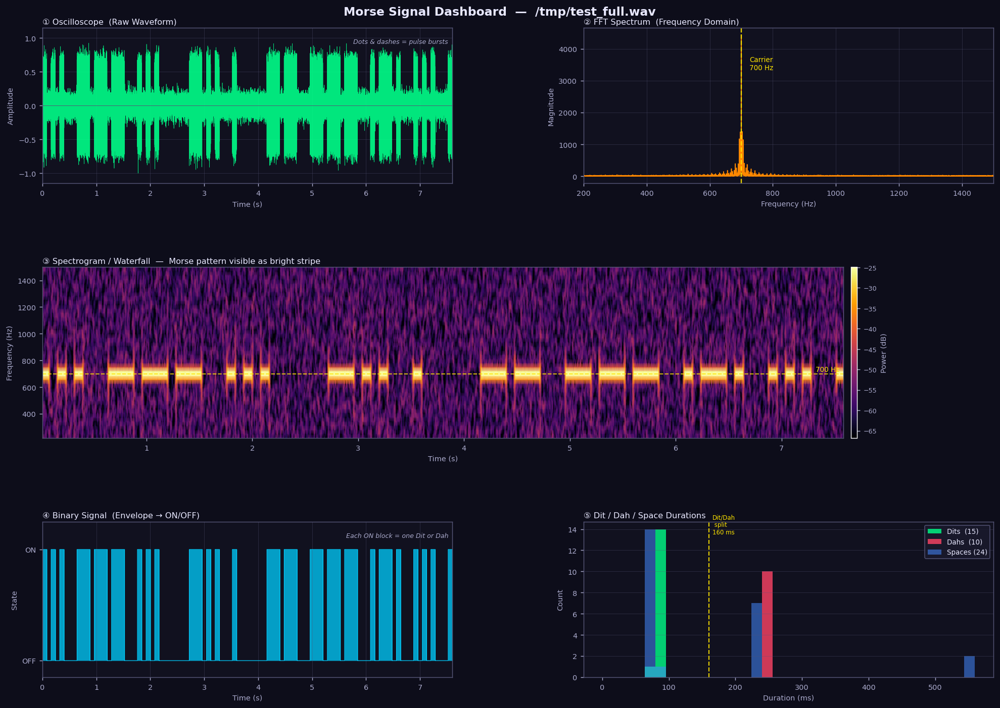

# Morse Code Decoder — Live Dashboard

A real-time Morse code decoder with a live GUI dashboard. Audio is captured from a WAV file, microphone, or system speakers and decoded to text using a DSP signal processing pipeline with a probabilistic N-gram correction layer. A separate CNN-LSTM deep learning model trained with CTC loss is also included for ML-based decoding.



---

## Features

- **Three audio sources**: WAV file playback, microphone, or system audio (WASAPI loopback on Windows)
- **Adaptive noise handling**: SNR-gated decoder rejects pure noise; adaptive threshold recovers weak signals
- **Probabilistic correction**: Character-level bigram/trigram N-gram model fills `[?]` gaps and fixes common Morse confusions
- **Live 5-panel signal visualiser**: oscilloscope, FFT spectrum, waterfall spectrogram, binary signal, and dit/dah duration histogram
- **Letter tile display**: each decoded character rendered as a coloured card with its Morse pattern underneath
- **CNN-LSTM model**: optional deep-learning path (train → checkpoint → inference) using mel spectrograms + CTC loss

---

## Quick Start

```bash
pip install -r requirements.txt

python main.py                  # open GUI
python main.py myfile.wav       # open GUI and decode a WAV immediately
python main.py --mic            # open GUI and start microphone immediately
```

---

## Architecture

```
┌──────────────────────────────────────────────────────────┐
│                        main.py                           │
│                    (entry point)                         │
└────────────────────────┬─────────────────────────────────┘
                         │
                         ▼
┌──────────────────────────────────────────────────────────┐
│                      src/ui.py                           │
│   DecoderUI ─► LivePlotter (5 panels)                   │
│             ─► LetterTilePanel                           │
│             ─► StreamingDecoder (coordinator)            │
└────┬─────────────────────────────────┬────────────────────┘
     │                                 │
     ▼                                 ▼
┌─────────────┐              ┌──────────────────────┐
│src/audio_   │              │     src/engine.py    │
│input.py     │──samples──►  │     MorseEngine      │
│AudioInput   │              │  (DSP decode)        │
│ - WAV file  │              └──────────┬───────────┘
│ - Mic (sd)  │                         │
│ - WASAPI    │              ┌──────────▼───────────┐
└─────────────┘              │   src/corrector.py   │
                             │   MorseCorrector     │
                             │  (N-gram fix-up)     │
                             └──────────┬───────────┘
                                        │ decoded text
                                        ▼
                               displayed in UI

src/constants.py ─────────────────────► used by engine + ui
src/model.py (CNN-LSTM) ──────────────► separate ML path
```

### Data & ML pipeline (optional)

```
scripts/generate_dataset.py  ──►  data/synthetic/
scripts/prepare_real_data.py ──►  data/real/
scripts/mix_datasets.py      ──►  data/combined/
scripts/train.py             ──►  model_best.pt
scripts/inference.py         ──►  decoded text (ML path)
```

---

## File Reference

### Entry Point

| File | Role |
|------|------|
| [main.py](main.py) | Parses CLI args (`--mic`, WAV path), checks tkinter availability, launches `DecoderUI`. The only file you need to run the application. |

### `src/` — Core Library

| File | Role |
|------|------|
| [src/constants.py](src/constants.py) | Defines `MORSE_MAP` (Morse pattern → character) and `TEXT_TO_MORSE` (inverse). Single source of truth for the symbol table — both `engine.py` and `ui.py` import from here. |
| [src/engine.py](src/engine.py) | `MorseEngine`: the primary DSP decoder. Pipeline: auto-detect carrier frequency via Welch PSD → bandpass filter (±200 Hz) → amplitude envelope → adaptive binary threshold → pulse duration segmentation → dit/dah/space classification → `MORSE_MAP` lookup. Includes an SNR gate (28 dB threshold) and a transition-rate check that together reject pure background noise. Also exposes `decode_wav()` as a standalone helper. |
| [src/audio_input.py](src/audio_input.py) | `AudioInput`: thread-based audio source with a callback/observer interface. Supports WAV file streaming (`stream_file_async`), microphone via `sounddevice`, and system audio via `pyaudiowpatch` WASAPI loopback. Handles resampling to 8 kHz and stereo→mono conversion internally. |
| [src/corrector.py](src/corrector.py) | `MorseCorrector`: character-level N-gram language model trained at runtime from a built-in English + amateur-radio corpus. Three-pass correction: tokenise → fill `[?]` slots using bigram/trigram context → fix low-confidence characters when an alternative is ≥50× more probable. Fulfils the "Probabilistic Correction" assignment requirement. |
| [src/model.py](src/model.py) | `MorseDecoder`: CNN-LSTM neural network for end-to-end decoding. Three conv blocks (each halving the frequency dimension) feed a 2-layer bidirectional LSTM. Output is log-softmax over a 44-token vocabulary + CTC blank. `greedy_decode()` collapses the output sequence. Used only by the `scripts/` ML path, not by the live DSP pipeline. |
| [src/ui.py](src/ui.py) | The complete GUI. `DecoderUI` builds the window and toolbar. `StreamingDecoder` buffers incoming audio chunks, throttles decode calls to every 0.4 s, and routes results to the UI via a thread-safe queue. `LivePlotter` drives the 5-panel Matplotlib canvas at 150 ms refresh. `LetterTilePanel` renders decoded characters as coloured cards. Uses the Catppuccin Mocha colour palette. |
| [src/\_\_init\_\_.py](src/__init__.py) | Makes `src/` a Python package. |

### `scripts/` — Data & Training Pipeline

| File | Role |
|------|------|
| [scripts/generate_dataset.py](scripts/generate_dataset.py) | Synthesises a labelled training dataset: renders 42-character Morse code to WAV at randomised speeds (5–30 WPM), tone frequencies, noise levels, and Farnsworth spacing. Writes `data/synthetic/audio/*.wav` and `metadata.json`. |
| [scripts/train.py](scripts/train.py) | Trains `MorseDecoder` on a `metadata.json` dataset. Uses `MelSpectrogram` input, CTC loss, Adam optimiser, and `ReduceLROnPlateau` scheduler. Saves the best validation checkpoint to `model_best.pt`. |
| [scripts/inference.py](scripts/inference.py) | Loads `model_best.pt` and runs the CNN-LSTM model on a WAV file, returning the greedy-decoded string. Alternative to the DSP pipeline for batch or offline use. |
| [scripts/prepare_real_data.py](scripts/prepare_real_data.py) | Ingests real-world Morse recordings and produces a `metadata.json` compatible with `train.py`. |
| [scripts/mix_datasets.py](scripts/mix_datasets.py) | Merges a synthetic and a real dataset into `data/combined/metadata.json` with configurable real-data oversampling (`--real-weight`). No files are copied; entries use absolute paths. |
| [scripts/download_ninja.py](scripts/download_ninja.py) | Downloads Morse Code Ninja practice files to use as real training data. |

### Tests

| File | What it tests |
|------|---------------|
| [tests/test_constants.py](tests/test_constants.py) | `MORSE_MAP` completeness and `TEXT_TO_MORSE` invertibility |
| [tests/test_engine.py](tests/test_engine.py) | `MorseEngine` on clean and noisy signals; SNR gate behaviour |
| [tests/test_corrector.py](tests/test_corrector.py) | N-gram gap-filling and low-confidence substitution |
| [tests/test_audio_input.py](tests/test_audio_input.py) | `AudioInput` WAV streaming and resampling |
| [tests/test_model.py](tests/test_model.py) | `MorseDecoder` forward pass shape; `greedy_decode` CTC collapse |
| [tests/test_generate_dataset.py](tests/test_generate_dataset.py) | Dataset generation: correct file count, valid WAV output |
| [tests/test_mix_datasets.py](tests/test_mix_datasets.py) | Dataset merging and oversampling logic |
| [tests/test_prepare_real_data.py](tests/test_prepare_real_data.py) | Real-data ingestion and metadata schema |
| [conftest.py](conftest.py) | Adds the project root to `sys.path` for all tests |

### Other Files

| File | Role |
|------|------|
| [requirements.txt](requirements.txt) | Python dependencies: `numpy`, `scipy`, `torch`, `torchaudio`, `pydub`. Optional: `sounddevice` (mic), `pyaudiowpatch` (WASAPI system audio). |
| [model_best.pt](model_best.pt) | Pre-trained CNN-LSTM checkpoint. Used by `scripts/inference.py`. |
| [images/](images/) | Dashboard screenshots for documentation. |

---

## DSP Decode Pipeline (detail)

The `MorseEngine` decode path, step by step:

1. **Frequency detection** — Welch PSD on the raw audio, peak in 300–1200 Hz range
2. **Bandpass filter** — 5th-order Butterworth, carrier ± 200 Hz
3. **Normalise** — divide by peak absolute value
4. **SNR estimate** — `20 × log10(P90 / P10)` of the envelope; gate at 28 dB
5. **Transition rate check** — transitions/sec on the binary signal; > 150/s = noise, not Morse
6. **Smooth & threshold** — 5 ms moving average; adaptive factor (0.35–0.50) based on SNR
7. **Pulse segmentation** — run-length encode the binary signal into (state, duration) pairs
8. **Noise spike filter** — drop pulses shorter than `rough_unit / 3`
9. **Dit estimate** — gap-based clustering on sorted ON durations to find the dit/dah boundary
10. **Decode** — ON durations: `< unit × 2` → dit, else dah. OFF durations: `> unit × 5` → word space, `> unit × 2.5` → char space
11. **Lookup** — `MORSE_MAP[morse_pattern]` per character; unknown patterns → `[?]`
12. **Correct** — `MorseCorrector.correct()` fills `[?]` and fixes likely substitution errors

---

## CNN-LSTM Model (detail)

`MorseDecoder` in [src/model.py](src/model.py):

```
Input: (B, 1, 64, T)  — log mel spectrogram (64 mel bands)
  │
  ├─ Conv2d(1→32, 3×3) + BN + ReLU + MaxPool(freq÷2)
  ├─ Conv2d(32→64, 3×3) + BN + ReLU + MaxPool(freq÷2)
  └─ Conv2d(64→128, 3×3) + BN + ReLU + MaxPool(freq÷2)
         │  freq dimension: 64 → 8
         ▼
  Reshape: (B, T, 128×8 = 1024)
         ▼
  BiLSTM(1024 → 256 hidden, 2 layers, dropout=0.3)
         ▼
  Dropout → Linear(512 → 44) → log_softmax
         ▼
Output: (B, T, 44)  — 43 characters + CTC blank token
```

Training uses CTC loss, which allows the model to learn alignments between the input spectrogram frames and the output character sequence without explicit frame-level labels.

---

## Dependencies

```
pip install numpy scipy torch torchaudio pydub

# For microphone input:
pip install sounddevice

# For system audio (Windows WASAPI loopback):
pip install pyaudiowpatch
```

Run tests:

```bash
pytest
```
